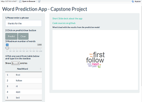

```{r setup, include=FALSE}
knitr::opts_chunk$set(echo = FALSE)
```

## Introduction

This is the final project of Coursera's Data Science Specialization. What an exciting and gratifying journey has been after 10 long courses!

The objective of this project was to put together everything we learned so far along the courses and build a model + an app that is able to predict the next word in a phrase.

The data utilised for this project comes from a corpus called HC Corpora <http://www.corpora.heliohost.org/aboutcorpus.html> (URL is not working at the moment). The files come from twitter, blogs and news sourced by a web crawler.

Given the size of the combined file and memory limitations I've completed the project with a sample of 10% of the raw data.


## About the algorithm
The steps to predict the next word in the app are as follow:

1. Take the input and depending on how many words it contains it extracts the last 2 words of the input.

2. Tokenize the words before passing it through the model.

3. Predict the next word using the prediction model.
    a. If input has no words then use model with 1-gram to predict.
    b. If input has 1 word then use model with 2-gram to predict.
    c. If input has 2 words then use model with 3-gram to predict.

The next slide will explain how the model was built.

## About the model
The model was done using Markov principles which states that we can predict the probability of future states without looking too far into the past.

The ranking for the next-word candidates was done through an algorithm called stupid backoff with a recommended value of 0.4 for lambda (see 2). This algorithm centres around n-grams.

For more information about Markov and the stupid backoff see the following links:

1.N-Grams and Markov: <https://lagunita.stanford.edu/c4x/Engineering/CS-224N/asset/slp4.pdf>

2.Stupid backoff: <https://github.com/hfoffani/dsci-benchmark>

## How to use the app
The application was designed to be very user friendly.
The user just needs to follow the numbers displyed in the UI.



First, type the phrase you want to use for prediction. Second, click on submit button. Third (optional), adjust the numer of words you want the model to return (default is 5). And forth, take a look at the first word in the list and type it back into the textbox above. The word cloud is a visualization of the probabilities from the model.
